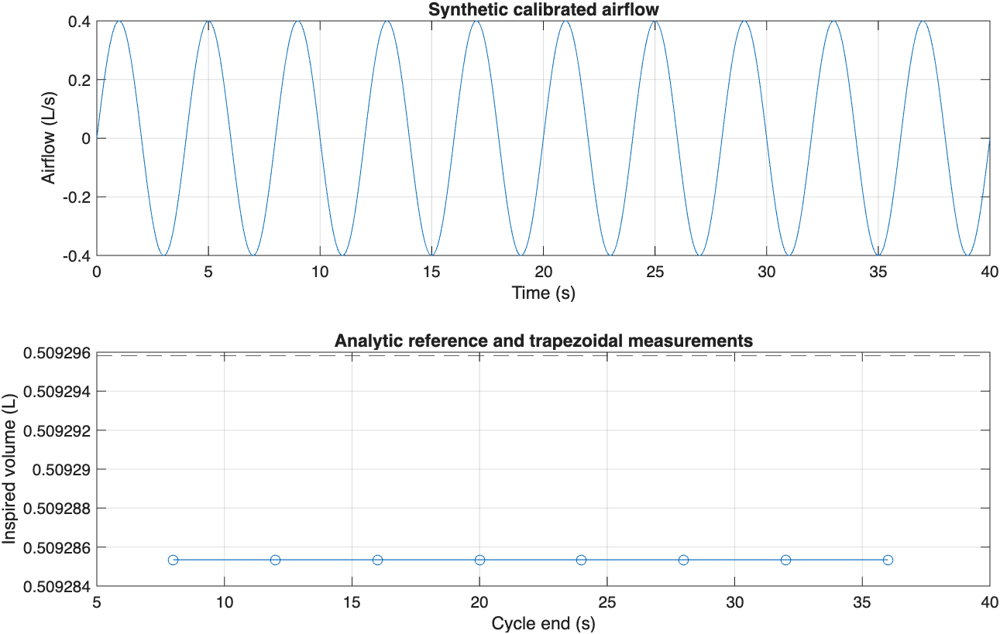

# PulseTrace

Offline MATLAB research workflows for radio-frequency physiological sensing, respiration, cardiac signals, and reference-signal comparison.

> **Development history:** Developed locally using Git before publication. These projects were published to GitHub together, so similar upload dates do not indicate when development began.

## Quick start

Open MATLAB in this repository, then use the branded entry point:

```matlab
crossings = pulse_trace(signal, sample_rate, struct('minTime', 0));
```

The entry point preserves the existing function's arguments, errors, and numerical output. Existing script and function names remain available for compatibility. No sensor starts when you open this repository.

## Offline airflow measurements (base MATLAB)

A complete calibrated airflow trace can now produce cycle timing, rate and inspired/expired volume without additional toolboxes:

```matlab
fs = 100;
t = (0:1/fs:40)';
flow = 0.4*sin(2*pi*0.25*t) + 0.07; % synthetic L/s, known offset
result = pulse_trace_airflow(flow, fs, struct('baseline', 0.07));
disp(result.cycles)
writetable(result.cycles, 'airflow-cycles.csv');
```

For a recording, supply a finite mono vector sampled uniformly at `fs`, in **liters/second**, positive for inspiration. Subtract a measured baseline using `opts.baseline`; the function does not infer calibration or remove drift. It measures complete rising/falling/rising zero-crossing cycles, interpolates crossing times, integrates each phase with trapezoids, and rejects phases shorter than `minPhaseSeconds` (default 0.3 s). Exact-zero plateaus use their midpoint; zero touches and incomplete edge cycles are ignored. `result.rejectedCycles` reports the short-phase exclusions. A constant or insufficient trace returns an empty cycles table.

No implicit smoothing is applied. Noisy flow, pauses, unknown polarity, sensor drift, RF amplitudes, or motion artifacts require justified preprocessing before this measurement path. This is a numerical research workflow, not clinical validation. See [method and evidence](docs/OFFLINE-ANALYSIS.md).



[Inspect the exported measurements](docs/results/airflow-cycles.csv). The plot shows synthetic numerical validation, not participant data.

## Inputs and workflows

The facade returns zero-crossing indices and direction. Complete study scripts use experiment-specific recordings, absolute paths, Signal Processing Toolbox and acquisition software. No clinical performance or new participant study is claimed. The two historical `rmse.m` stubs now return `[RMSE, sample standard deviation of signed errors]` for finite paired vectors. Separately supplied TDMS, ECG and Bland-Altman utilities retain their own terms.

## Verification

Run `run('tests/smoke_test.m'); run('tests/offline_test.m')` from the repository root. See [verification details](docs/VERIFICATION.md) for the tested scope and unavailable checks. The original facade remains numerically compatible. The added offline analysis is independent of the historical study scripts; the two unusable RMSE stubs are the only modified historical computational files.

## License

MIT covers authorized first-party code and new presentation. Embedded and nested third-party licenses continue to apply.
